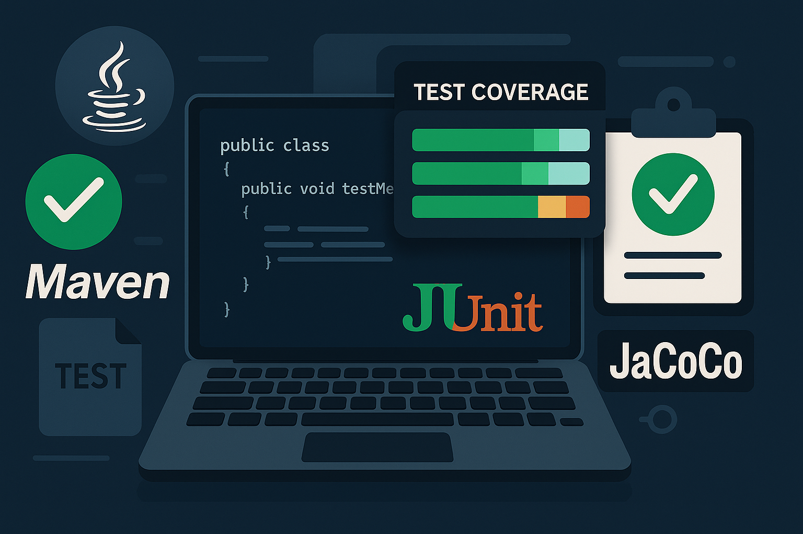

# Implementando Testes Unitários em um Projeto Java com Maven



## Por que Escrever Testes Unitários?

Testes unitários garantem que cada parte do seu código funciona como esperado, facilitando a manutenção, refatoração e evolução do projeto. Eles ajudam a identificar rapidamente bugs e reduzem o custo de correção de erros.

## Estrutura de Pastas Padrão

Para projetos Java seguindo o padrão Maven, a estrutura recomendada é:

```plaintext
project-root/
│
├── src/
│   ├── main/
│   │   └── java/
│   │       └── com/
│   │           └── mulato/
│   │               └── FileBackup.java
│   └── test/
│       └── java/
│           └── com/
│               └── mulato/
│                   └── FileBackupTest.java
```

## Boas Práticas para Testes Unitários

- **Nomeie os métodos de teste de forma clara**: O nome deve indicar o que está sendo testado e o resultado esperado.
- **Teste apenas uma lógica por método**: Cada teste deve validar um único comportamento.
- **Evite dependências externas**: Use mocks para simular recursos externos (banco de dados, arquivos, etc).
- **Garanta independência dos testes**: Os testes devem poder ser executados em qualquer ordem.
- **Mantenha os testes rápidos**: Testes lentos dificultam a integração contínua.

## Configurando Dependências no Maven

No arquivo `pom.xml`, adicione as dependências do JUnit 5 para testes e do JaCoCo para cobertura de código:

```xml
<dependency>
    <groupId>org.junit.jupiter</groupId>
    <artifactId>junit-jupiter</artifactId>
    <version>5.10.2</version>
    <scope>test</scope>
</dependency>
```

E o plugin do JaCoCo dentro da seção `<build>`:

```xml
<plugin>
    <groupId>org.jacoco</groupId>
    <artifactId>jacoco-maven-plugin</artifactId>
    <version>0.8.11</version>
    <executions>
        <execution>
            <goals>
                <goal>prepare-agent</goal>
            </goals>
        </execution>
        <execution>
            <id>report</id>
            <phase>test</phase>
            <goals>
                <goal>report</goal>
            </goals>
        </execution>
    </executions>
</plugin>
```

## Tornando Métodos Testáveis

Para que os métodos possam ser testados, eles não devem ser `private`. Altere para `static` (sem modificador) ou `public`:

```java
// Antes
private static void copyDirectory(...);
private static int countFiles(...);

// Depois
static void copyDirectory(...);
static int countFiles(...);
```

## Exemplos de Asserts no JUnit

Além do `assertEquals` e `assertTrue`, o JUnit oferece outros métodos úteis:

```java
assertFalse(condition);
assertNull(object);
assertNotNull(object);
assertThrows(Exception.class, () -> { /* código */ });
```

## Utilizando Mocks em Testes

Para testar métodos que dependem de recursos externos, utilize bibliotecas como Mockito:

```xml
<dependency>
    <groupId>org.mockito</groupId>
    <artifactId>mockito-core</artifactId>
    <version>5.2.0</version>
    <scope>test</scope>
</dependency>
```

Exemplo de uso:

```java
import static org.mockito.Mockito.*;

MyService service = mock(MyService.class);
when(service.doSomething()).thenReturn("resultado");
```

## Integração Contínua e Testes Automatizados

Configure pipelines de CI (como GitHub Actions, GitLab CI, Jenkins) para rodar os testes automaticamente a cada push. Isso garante que novas alterações não quebrem funcionalidades existentes.

## Exemplo de Classe de Teste Unitário

```java
package com.mulato;

import org.junit.jupiter.api.Test;
import java.io.*;
import java.util.concurrent.atomic.AtomicInteger;
import static org.junit.jupiter.api.Assertions.*;

class FileBackupTest {

    @Test
    void testCountFilesEmptyFolder() throws IOException {
        File tempDir = new File("testDirEmpty");
        tempDir.mkdir();
        try {
            int count = FileBackup.countFiles(tempDir);
            assertEquals(0, count);
        } finally {
            tempDir.delete();
        }
    }

    @Test
    void testCopyDirectory() throws IOException {
        File sourceDir = new File("sourceDir");
        File destDir = new File("destDir");
        sourceDir.mkdir();
        destDir.mkdir();
        File file = new File(sourceDir, "file.txt");
        try (FileWriter fw = new FileWriter(file)) {
            fw.write("test");
        }
        AtomicInteger filesProcessed = new AtomicInteger(0);

        try {
            FileBackup.copyDirectory(sourceDir, destDir, filesProcessed);
            File copiedFile = new File(destDir, "file.txt");
            assertTrue(copiedFile.exists());
            assertEquals(1, filesProcessed.get());
        } finally {
            file.delete();
            sourceDir.delete();
            for (File f : destDir.listFiles()) f.delete();
            destDir.delete();
        }
    }
}
```

## Testando o Método Main

Para garantir que o método `main` executa sem lançar exceções:

```java
package com.mulato;

import org.junit.jupiter.api.Test;
import static org.junit.jupiter.api.Assertions.assertDoesNotThrow;

public class MainTest {
    @Test
    void testMainRunsWithoutException() {
        assertDoesNotThrow(() -> Main.main(new String[]{}));
    }
}
```

## Gerando Relatórios de Cobertura com JaCoCo

Após configurar o plugin, execute:

```bash
mvn clean test
```

O relatório será gerado em:  
`target/site/jacoco/index.html`

Abra esse arquivo no navegador para visualizar a cobertura dos testes.

## Recursos e Leituras Complementares

- [Documentação Oficial do JUnit 5](https://junit.org/junit5/docs/current/user-guide/)
- [Mockito - Site Oficial](https://site.mockito.org/)
- [Guia de Cobertura de Código com JaCoCo](https://www.jacoco.org/jacoco/trunk/doc/)
- [Boas Práticas de Testes Unitários (Martin Fowler)](https://martinfowler.com/bliki/UnitTest.html)

---

**Resumo:**

- Estruture seu projeto conforme o padrão Maven.
- Adicione JUnit e JaCoCo ao `pom.xml`.
- Torne métodos utilitários testáveis (não privados).
- Escreva testes unitários para métodos de lógica.
- Gere e consulte o relatório de cobertura com JaCoCo.