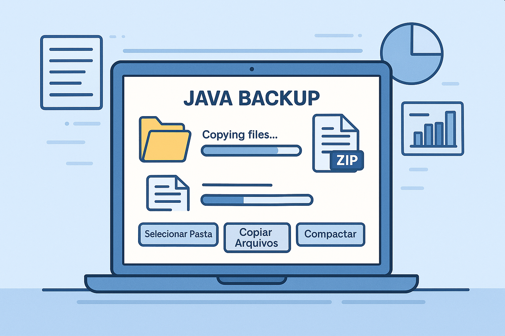
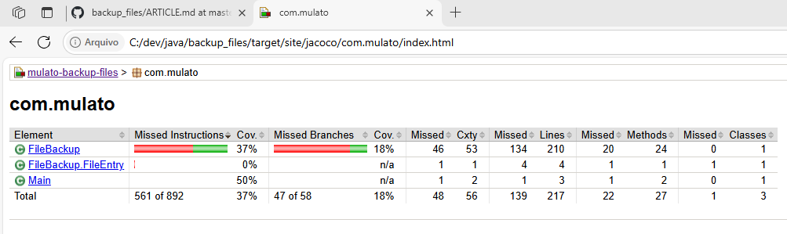

# Backup de Arquivos



Uma ferramenta simples para realizar backup de arquivos e compactá-los em vários arquivos ZIP.

## Visão Geral

Este aplicativo Java permite:

- Selecionar um diretório fonte para backup
- Copiar arquivos para um diretório temporário
- Compactar os arquivos em múltiplos arquivos ZIP com tamanho limitado
- Gerar logs detalhados das operações de backup

## Requisitos

- Java 8 ou superior
- Apache Commons Compress 1.21
- Maven (para compilação, testes e cobertura de código)

## Como Usar

### Usando os scripts

O aplicativo inclui scripts de execução para Windows e Linux/macOS:

**Windows:**

```bash
executar-backup.bat
```

**Linux/macOS:**

```bash
chmod +x executar-backup.sh
./executar-backup.sh
```

### Interface do Aplicativo

1. Clique em **Selecionar Pasta** para escolher o diretório que deseja fazer backup.
2. Clique em **Copiar Arquivos** para iniciar a cópia dos arquivos para o diretório temporário.
3. Após a conclusão da cópia, clique em **Compactar** para gerar os arquivos ZIP.
4. Os arquivos de backup serão salvos no diretório de destino.

## Características

- **Divisão de arquivos**: Gera múltiplos arquivos ZIP com tamanho máximo definido
- **Compressão de alta performance**: Utiliza nível máximo de compressão (nível 9)
- **Registro detalhado**: Cria logs com informações de todos os arquivos processados, incluindo caminho completo
- **Barra de progresso**: Mostra o andamento da operação em tempo real

## Estrutura do Projeto

```bash
src/main/java/com/mulato/        # Código-fonte da aplicação
src/test/java/com/mulato/        # Testes unitários
FileBackup.java                  # Classe principal com interface gráfica e lógica de backup
FileBackupTest.java              # Testes unitários para FileBackup
MainTest.java                    # Teste para o método main
executar-backup.bat              # Script para Windows
executar-backup.sh               # Script para Linux/macOS
pom.xml                          # Configuração do Maven (dependências, plugins, cobertura)
```

## Testes Unitários e Cobertura de Código

O projeto utiliza **JUnit 5** para testes unitários e **JaCoCo** para análise de cobertura de código.

### Executando os testes

Para rodar os testes e gerar o relatório de cobertura, utilize:

```bash
mvn clean test
```

O relatório de cobertura será gerado em:

```bash
target/site/jacoco/index.html
```

Abra esse arquivo no navegador para visualizar a cobertura dos testes.



### Exemplo de Teste Unitário

```java
import org.junit.jupiter.api.Test;
import java.io.File;
import java.io.IOException;
import static org.junit.jupiter.api.Assertions.*;

class FileBackupTest {

    @Test
    void testCountFilesEmptyFolder() throws IOException {
        File tempDir = new File("testDirEmpty");
        tempDir.mkdir();
        try {
            int count = FileBackup.countFiles(tempDir);
            assertEquals(0, count);
        } finally {
            tempDir.delete();
        }
    }
}
```

## Logs de Backup

Os logs são gerados na pasta de destino e contêm:

- Data e hora do backup
- Nome dos arquivos ZIP gerados
- Caminho completo de cada arquivo incluído no backup
- Mensagens de erro (caso ocorram)

## Aviso

Este aplicativo foi desenvolvido para uso pessoal e educacional. Para ambientes de produção, considere recursos adicionais como:

- Criptografia dos arquivos de backup
- Verificação de integridade
- Backup incremental
- Agendamento automático